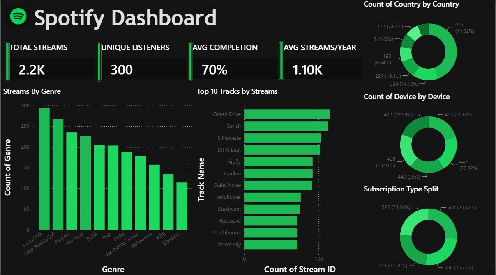

# Spotify Power BI Dashboard

An interactive Power BI dashboard analyzing Spotify streaming data using DAX measures, built to explore listening patterns across genres, tracks, devices, and subscription types.

## 📊 Dashboard Overview

## Key Metrics
- **Total Streams:** 2.2K
- **Unique Listeners:** 300
- **Avg Completion Rate:** 70%
- **Avg Streams/Year:** 1.10K

## Key Insights
- **Lo-fi/Chill and Coke Studio/Sufi** are the top-streamed genres, followed closely by Punjabi and Hip-Hop
- **"Ocean Drive"** leads as the most-streamed track, with the top 10 tracks showing fairly even distribution
- Streaming is split almost evenly across **4 device types** (~19-21% each), showing no single dominant platform
- **Subscription types** are nearly evenly distributed across 4 tiers (~24-26% each)
- Country-wise streaming is led by one region at **44.3%**, with the remaining streams spread across several others

## Tools Used
- Power BI Desktop
- DAX (measures for completion rate, average streams/year, etc.)
- Power Query (data cleaning & transformation)

## File
- `spotify-dashboard.pbix` — open in
